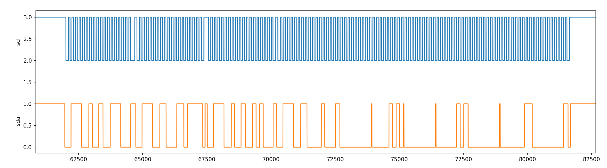
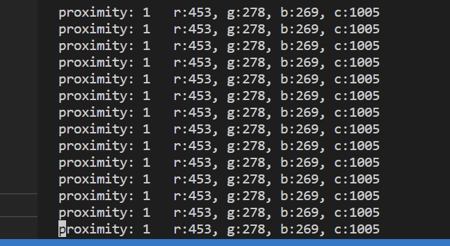
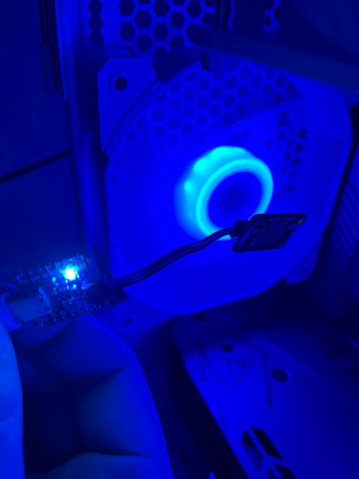

University of Pennsylvania, ESE 5190: Intro to Embedded Systems, Lab 2B

```
Qiwen Luo
    https://www.linkedin.com/in/qiwen-luo-33a058226/
Tested on: 
	ROG Zephyrus M16
	Intel Core i7-11800H
	16GB RAM
	Windows 10 21H2
	WSL2: Ubuntu 20.04.5 LTS
Board:
	Adafruit qtpy RP2040
Sensors:
	build-in neopixel (WS2812)
	Adafruit APDS9960
```

# Introduction

This lab is basically to create a logic analyzer by for embedded system coding. The specialty of  this project is that starting from reading and storing inputs via high-level GPIO functions, to reading and inputting with PIO and direct DMA access to storage, while using PIO to emulate I2C to drive sensors.

All the I/O engine is based on PIO or register r/o, except for the GPIO function which is used in a few places to read the boot button.

All the code is in folder 'lab' with details.

# Demo

### Pio_Scope



### APDS9960 Driver



### WS2812 Driver



# Reference

### PICO

- [Raspberry Pi Pico C/C++ SDK](https://datasheets.raspberrypi.com/pico/raspberry-pi-pico-c-sdk.pdf)
- [RP2040 Data sheet](https://datasheets.raspberrypi.com/rp2040/rp2040-datasheet.pdf)

### Sensor

- [Understanding the I2C bus](https://www.ti.com/lit/an/slva704/slva704.pdf?ts=1668500715866&ref_url=https%253A%252F%252Fwww.google.com%252F)
- [APDS-9960 Datasheet](https://cdn.sparkfun.com/assets/learn_tutorials/3/2/1/Avago-APDS-9960-datasheet.pdf)
- [APDS-9960 Arduino Library](https://github.com/arduino-libraries/Arduino_APDS9960)

### Strongly recommended: A Fantastic Serial Terminal based on Pyserial

- [eRCaGuy_PyTerm](https://github.com/ElectricRCAircraftGuy/eRCaGuy_PyTerm)

  with a python script to process the reading data

