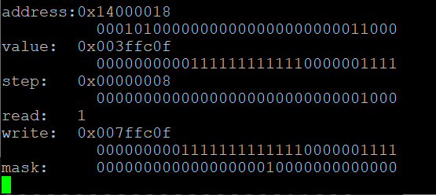
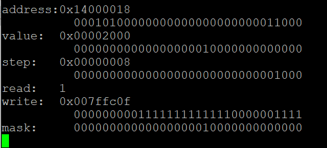

### TODO:

Create a REPL to let you read and write RP2040 registers from a console. You should be able to:
- select any 32-bit address to read/write (even if not a valid RP2020 address)  :heavy_check_mark:

  ```c
  data.addr = (uint32_t *) 0x00000000;
  data.step = (uint32_t) 0x00000001;
  ```

  Basically, the value and the address can be set as above.

  In changing the address, we should notified that, if we want to add 1 to address for example

  ```
  data.addr = (uint32_t *) 0x00000000 + 1u;
  ```

  We will find that the address will increase by 4u;

  Thus, wen we display the step we add to the address, we would better show the result after multiplying by 4.

  ```
  printf("step:   0x%08x\n",data.step<<2);
  printf("          %032b\n",data.step<<2);
  ```

  

- read/write any 32-bit value to this address :heavy_check_mark:

  

- read/write using any of the atomic bit-setting aliases and a 32-bit mask :heavy_check_mark:

  


