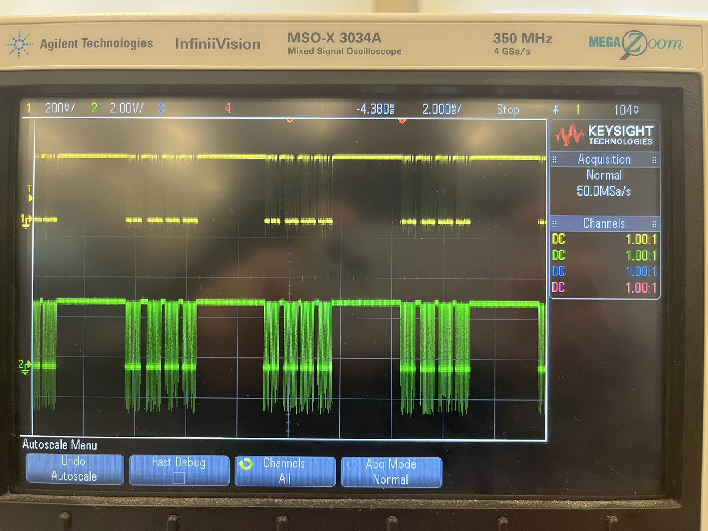
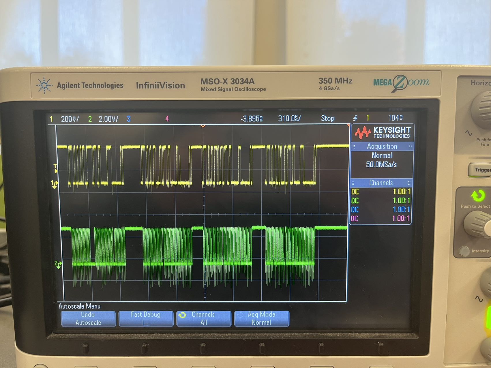
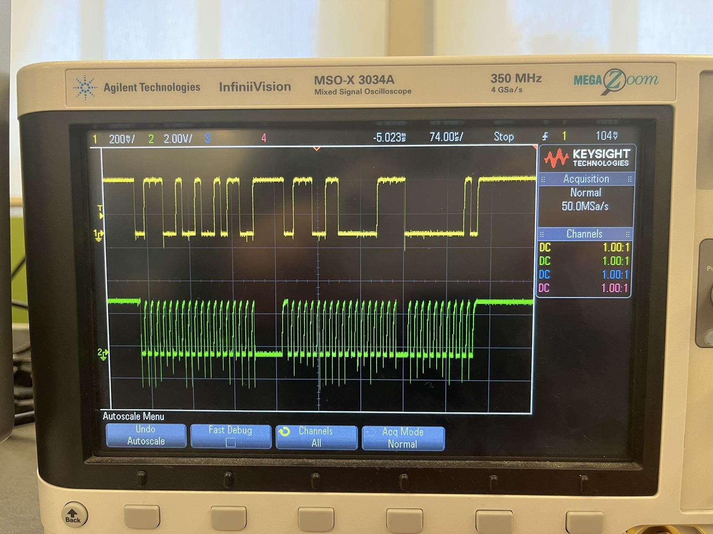
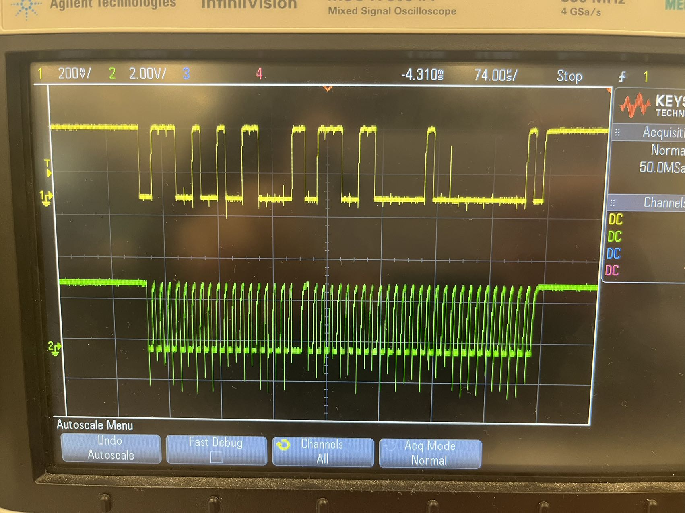
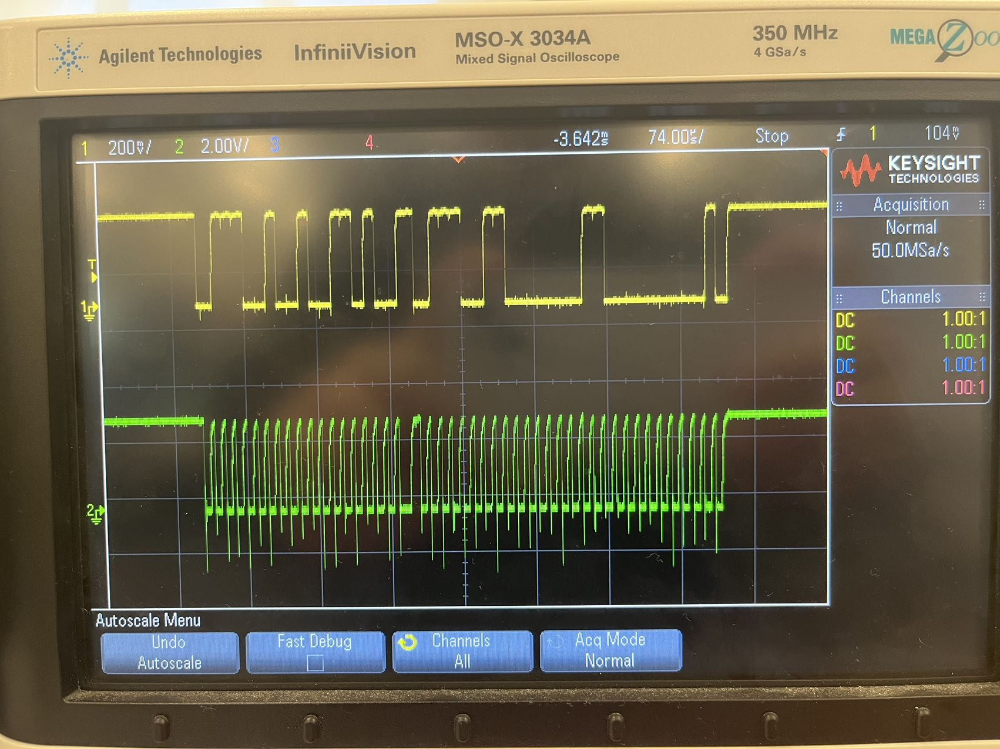
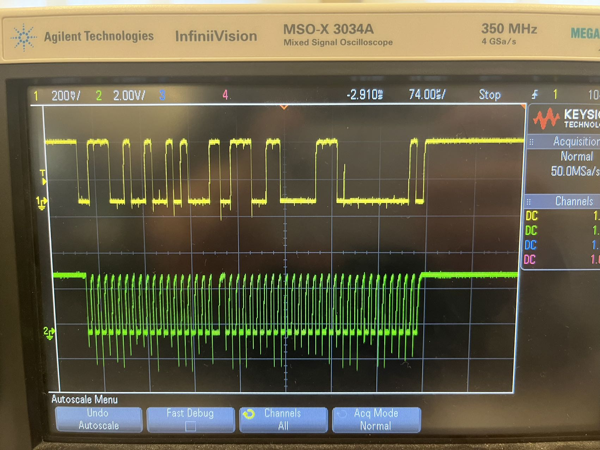
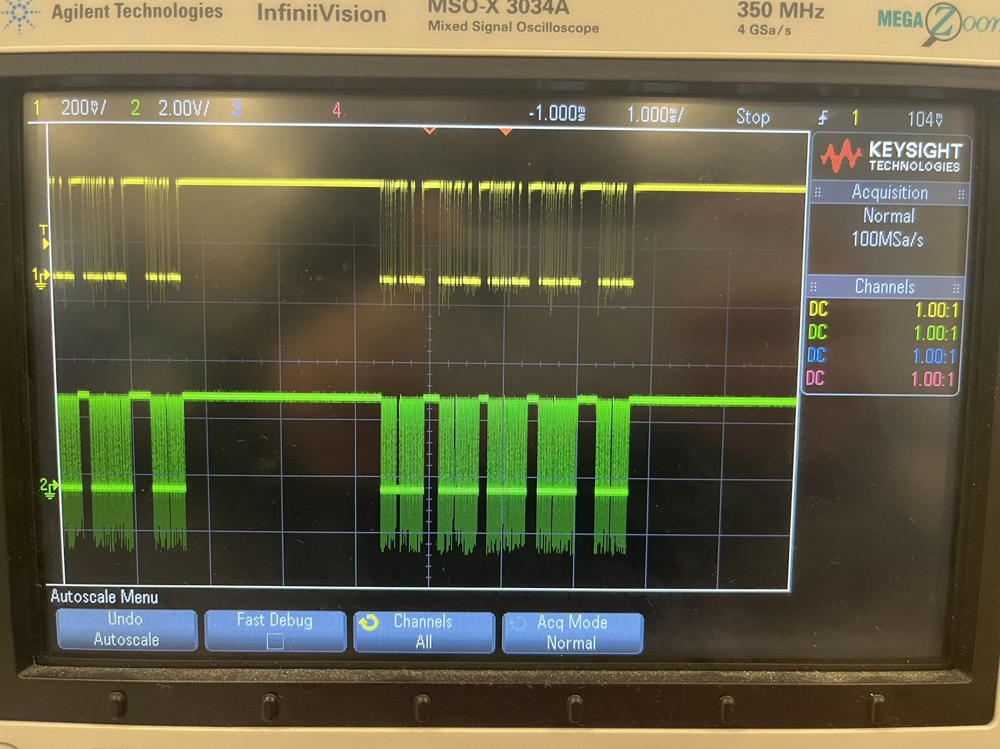
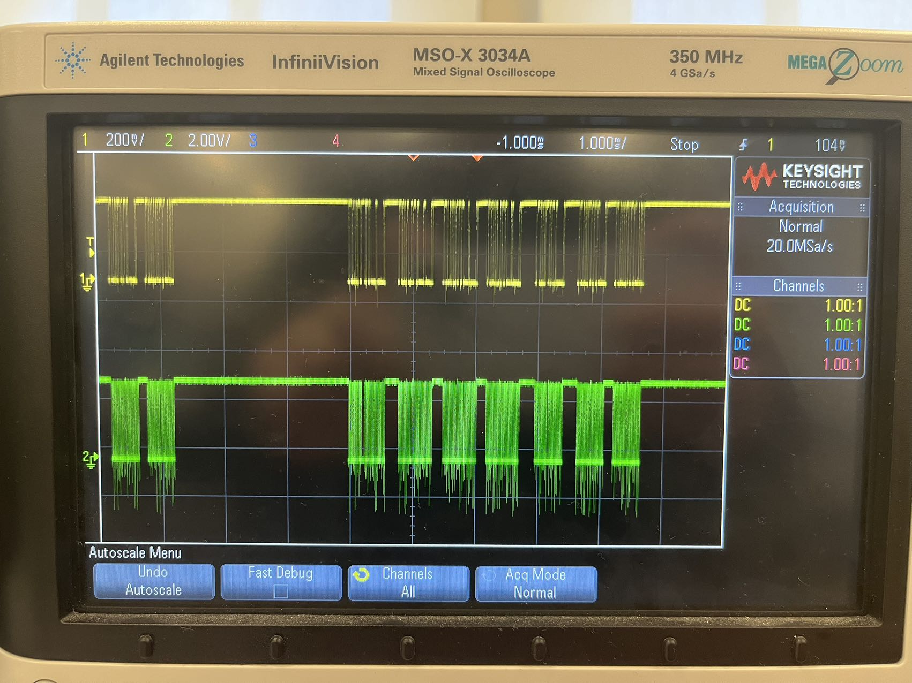

### TODO:

- use your Lab 1 firefly code to generate ADPS9960 I2C traffic and display it on a lab oscilloscope
- take a screenshot of some portion of this exchange, and figure out/annotate what's happening based on the protocol documentation in the ADPS9960 datasheet 

### Test Result

First, we set the program request for r,g,b,c data. Then we can see the signal on oscilloscope that 4 data are sending at one time.

After zooming in, we can see how the 4 data are represented in the transmission process.

After we add a request for proximity, the data package became 5. (proximity + color)

For gesture, package become 7. (gesture + color)

