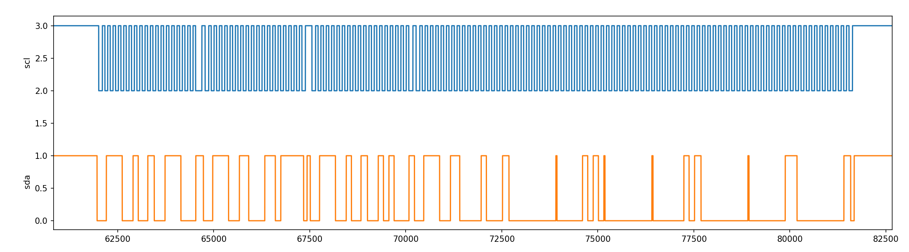

### TODO:

- modify the PIO/DMA logic analyzer example to record a timestamped trace of an RP2040-ADPS9960 exchange while the BOOT button is pressed :heavy_check_mark:
- with a partner, connect a second Qt Py to the Stemma Qt bus of an ADPS9960 that's attached to a first Qt Py running the Lab 1 Python code :heavy_check_mark: **not using Python code, but PIO-i2c. Shown in 07 pio_sequencer**
- record a trace of this exchanged​ :heavy_check_mark:

### Note:

plot the serial output of SCL and SDA

4 data package

The sampling rate is 8 times of i2c rate.

5ms per packet interval, which is 0.005 x 1600 x 8000 = 64000 cycle.

Thus, the PIO scope seems work correctly.