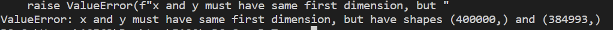
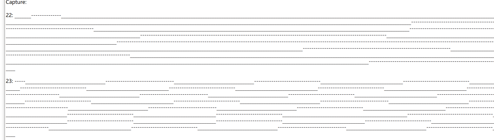

### TODO:

- modify your sequencer to use the PIO as its primary I/O engine, including the ability to R/W any register 

### NOTE:

- modify the pio.i2c example to drive and read data from APDS9960.
- now can monitor the data flow throgh the i2c bus.
- bus rate is 400kbits, and the sampling rate is 1600*8kHz.
- if smaple number is too large (such as 400000), some data may loss.
  - 
- 

### EXAMPLE:

- serial log file:

