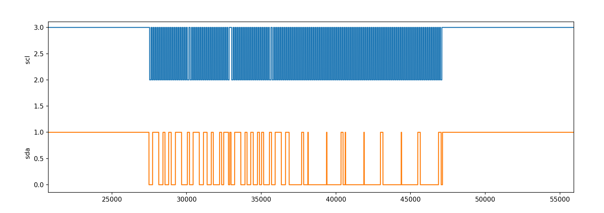

### TODO:

- modify your sequencer to use the PIO as its primary I/O engine, including the ability to R/W any register 

### NOTE:

- modify the pio.i2c example to drive and read data from APDS9960.
- now can monitor the data flow throgh the i2c bus.
- bus rate is 400kbits, and the sampling rate is 1600*8kHz.
- if smaple number is too large (such as 400000), some data may loss.
  - 
- while drive though i2c, we record the data flow and then play them on the i2c pins though PIO, which is simulating what we send from our board to APDS9960.

### EXAMPLE:

- We have record the fetching data process, and play them through PIO, looks like the same as what we find in prat6.

  

  To realize this, we just have to write a auto pull function and attach them to the output pin and write the data in the capture buffer.

  the instruction set can simply write like this:

  ```c
  uint16_t out_prog_instr = pio_encode_out(pio_pins, pin_count);
  struct pio_program out_prog = {
      .instructions = &out_prog_instr,
      .length = 1,
      .origin = -1
  };
  uint offset = pio_add_program(pio, &out_prog);
  ```

  
