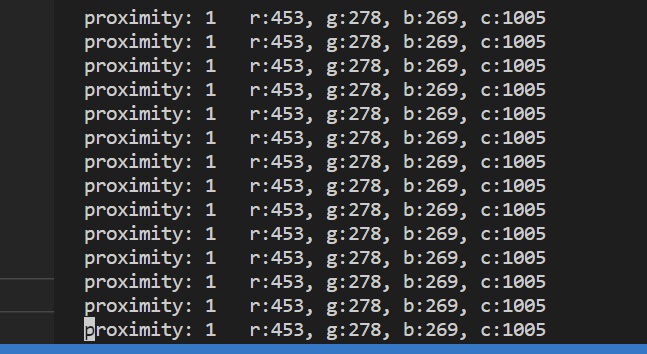

### TODO:

Use the capabilities of your sequencer to implement the ADPS9960 protocol and control the sensor.

### NOTE:

This include drive for APDS9960 through pio-i2c.

Combining the regular i2c code with pio-i2c code, we write our own protocol

### DEMO:



### KEY POINT:

#### 1. PIO READ EXAPMLE ISSUE

We find that the original pio-i2c is not working, from i2c example we can know that, the read programme should be like this

```c
void read_proximity(int32_t* proximity) {

    uint8_t buf[1];
    uint8_t reg = PDATA_REG;
    i2c_write_blocking(i2c_default, addr, &reg, 1, true);  // true to keep master control of bus
    i2c_read_blocking(i2c_default, addr, buf, 1, false);  // false - finished with bus

    *proximity = buf[0];
}
```

Here we see that first the master should write a command to bus without stop bit. 

Also, from a reference, we can know that the following should be a repeat start bit.


However, in the pio-read function, it seems not working.

```c
int pio_i2c_read_blocking(PIO pio, uint sm, uint8_t addr, uint8_t *rxbuf, uint len) {
    int err = 0;
    pio_i2c_start(pio, sm);
    pio_i2c_rx_enable(pio, sm, true);
...
```

We can see here the read function first do a start bit, this may be the reason. After replace it with function "repstar", it works.


#### PIO file issue

Same question find on a [website](https://forums.raspberrypi.com/viewtopic.php?t=340111), the read function cannot return a correct value. 

And the solution will work, clear the IRQ at the end of ACK pulse


### Other Method:

We have record the fetching command on i2c pins in part 7, in order to do this, we can just send this 'binary command' on pins through PIO.

However, it seems hard to get the data into program that drive the ws2812.